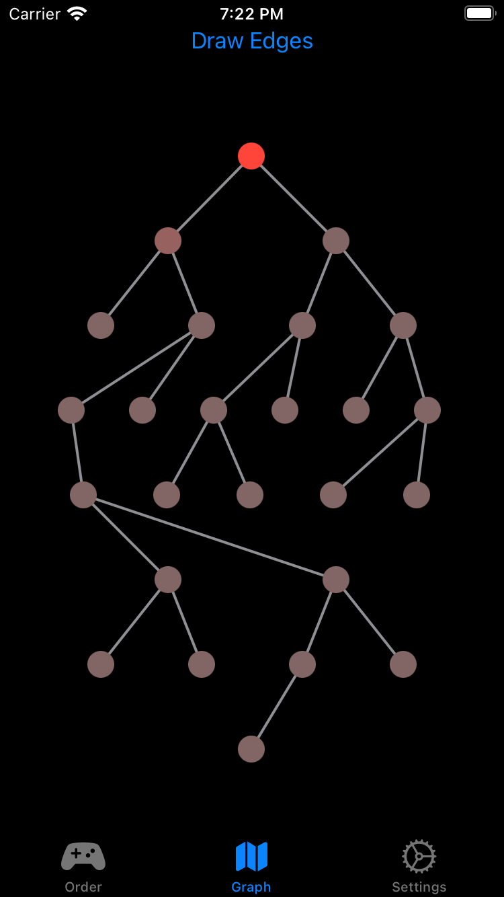

# CYOA Story App

This is a story app that my friend and I have built using SwiftUI. Here are some images:

<table>
  <tr>
    <td></td>
    <td></td>
  </tr>
 </table>

You are seeing the story and the node view. The node view shows how many times a section has been visited. The darkder the red means the more times a node has been visted. 
